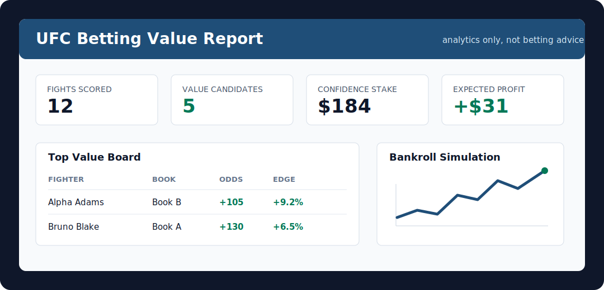
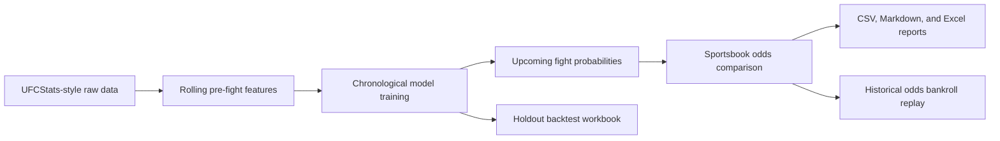

# UFC Predictor

[](https://github.com/Fink692/ufc-predictor/actions/workflows/tests.yml)
[](https://www.python.org/)
[](LICENSE)

Leakage-safe UFC fight winner modeling, odds comparison, and report generation for reproducible MMA analytics.

The project trains on historical UFCStats-style data using only information that would have been available before each bout. It builds rolling fighter profiles, evaluates models chronologically, scores upcoming fights, compares model probabilities to sportsbook moneylines, and exports professional CSV, Markdown, and Excel reports.

> Analytics only. This is not betting advice.



## What It Does

- Builds pre-fight features for age, reach, stance, layoffs, Elo, opponent strength, recent form, striking, grappling, control, stamina, late-round fade, and championship-round history.
- Trains an order-balanced model so results are not inflated by fighter ordering artifacts.
- Scores upcoming fights with calibrated probabilities, picks, confidence, and model-implied fair odds.
- Ranks sportsbook lines by implied probability, model edge, expected ROI, conservative Kelly sizing, payout, loss exposure, and risk label.
- Backtests historical odds files with conservative Kelly, flat-stake, and confidence-stake bankroll simulations.
- Compares model families and reports calibration error so probability quality is visible, not just accuracy.
- Produces shareable betting and backtest workbooks with tables, charts, and fight-level rows.

## Benchmark Snapshot

Latest local run using the public UFCStats mirror from [`Greco1899/scrape_ufc_stats`](https://github.com/Greco1899/scrape_ufc_stats):

| Item | Value |
| --- | ---: |
| Source fights | 8,701 |
| Trainable fights | 8,547 |
| Date range | 1994-03-11 to 2026-05-16 |
| Model features | 148 active in benchmark; 165 current schema columns with optional context hooks |
| Stamina/fade features | 39 |
| Holdout split | Latest chronological 20% |
| Holdout rows | 1,709 |

| Metric | Model | Baseline |
| --- | ---: | ---: |
| Accuracy | 63.55% | 55.71% |
| Log loss | 0.6441 | 0.6931 |
| ROC AUC | 0.6695 | 0.5000 |

The benchmark report is reproducible from the raw public data. Generated runtime outputs under `reports/`, `models/`, and `data/` are intentionally ignored by git.

## Example Artifacts

- [Backtest workbook](docs/artifacts/ufc_backtest_tables_charts.xlsx)
- [Fight-level backtest rows](docs/artifacts/ufc_holdout_backtest_rows.csv)
- [Example betting workbook](docs/artifacts/ufc_betting_report_example.xlsx)
- [Example historical odds backtest workbook](docs/artifacts/ufc_historical_odds_backtest_example.xlsx)

The backtest workbook uses a chronological holdout and a synthetic even-money confidence-stake simulation because the repository does not include a complete historical sportsbook closing-line dataset. The betting workbook uses fixture odds so the report format can be reviewed without a live odds API key.

## Workflow



## Quick Start

Install the package in editable mode, then use `ufc-predict --help` to inspect the available commands.

```powershell
python -m pip install -e ".[dev]"
ufc-predict --help
```

For the complete training, prediction, odds, and workbook workflow, see [Workflow Guide](docs/WORKFLOW.md).

## Inputs

Core historical tables:

| File | Purpose |
| --- | --- |
| `events.csv` | Event names and dates |
| `fighters.csv` | Fighter profile data such as date of birth, height, reach, and stance |
| `fights.csv` | Matchups, results, method, weight class, scheduled rounds, and title-fight flag |
| `fight_stats.csv` | Per-fighter fight totals plus optional late-round aggregates |

Upcoming fights use `event_date`, `fighter_a`, `fighter_b`, `weight_class`, `gender`, `scheduled_rounds`, and `title_fight`. Odds boards use one row per sportsbook line with `event_date`, matchup names, sportsbook, fighter, and American odds.

Optional contextual columns can be added when available: short notice flags, weight misses, camp changes, disclosed injury flags, camps, altitude, and travel-distance differences. Missing context defaults to neutral values so the public UFCStats workflow still runs cleanly.

## Reports

| Output | Description |
| --- | --- |
| Predictions | Fight-level probabilities, picks, confidence, and model version |
| Value board | Every available sportsbook line ranked by edge, expected ROI, stake, payout, and risk |
| Fight recommendations | One row per fight with the model pick, best available odds, confidence stake, expected profit, and max loss |
| Betting workbook | Summary, recommendations, value board, best lines, top matchups, raw odds, predictions, and charts |
| Backtest workbook | Holdout metrics, fight rows, confidence buckets, yearly splits, threshold scenarios, and charts |
| Historical odds backtest | Real odds replay with Kelly, flat-stake, and confidence-stake bankroll simulations |
| Calibration report | Probability bucket table with observed win rate, expected calibration error, and maximum calibration error |
| Model comparison | Chronological holdout comparison across logistic, random forest, and gradient boosting families |

Confidence stake sizing maps a coin-flip pick to `$0` and a 100% confident pick to the configured max stake. By default, value-bet staking uses quarter Kelly capped at 2% of bankroll.

## Documentation

- [Workflow Guide](docs/WORKFLOW.md)
- [Model Card](docs/MODEL_CARD.md)
- [Data Notes](docs/DATA.md)
- [Results](docs/RESULTS.md)
- [Odds And Risk](docs/ODDS.md)
- [Backtest Workbook](docs/BACKTEST_WORKBOOK.md)
- [Contributing](CONTRIBUTING.md)
- [Security](SECURITY.md)

## Caveats

UFC prediction is noisy. Public models often report inflated results because they accidentally include future information in historical aggregates. This project is designed around rolling pre-fight features, but it still does not include private/contextual signals such as injuries, camp quality, short-notice changes, current market movement, and medical information.

## License

MIT. See [LICENSE](LICENSE).
